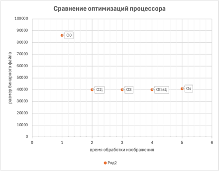

# Пояснительная записка к курсовому проекту
**Тема:** Реализация алгоритма сжатия изображений с использованием субдискретизации цветности (аналог JPEG)

## 1. Цель работы
Разработка программы, реализующей:
- Преобразование RGB → YCbCr
- Субдискретизацию цветовых компонент (4:2:0)
- Обратное преобразование YCbCr → RGB
- Оценку качества сжатия через PSNR и MSE
- проанализировать флаги оптимизации

## 2. Описание алгоритма

### 2.1 Основные этапы
#### 1. **Чтение JPEG**
- Используется библиотека ```libjpeg```
- Вход: файл в формате JPEG
- Выход: массив пикселей в RGB

#### 2. **Цветовое преобразование**
   ```math
   Y  =  0.299R + 0.587G + 0.114B  
   Cb = -0.1687R - 0.3313G + 0.5B + 128  
   Cr =  0.5R - 0.4187G - 0.0813B + 128
   ```
#### 3. **Субдискретизация 4:2:0**

- Уменьшение разрешения компонент Cb/Cr в 2 раза по горизонтали и вертикали
- Усреднение значений в блоках 2×2 пикселя

#### 4. **Обратное преобразование**
    ```math
    R = Y + 1.402(Cr - 128)  
    G = Y - 0.34414(Cb - 128) - 0.71414(Cr - 128)  
    B = Y + 1.772(Cb - 128)
    ```

5. **Оценка качества**

- MSE: Среднеквадратичная ошибка
- PSNR: Пиковое отношение сигнал/шум

## 3. Реализация

### 3.1 **Используемые технологии**

- Язык: C++17
- Библиотеки:
  - libjpeg-turbo (чтение/запись JPEG)
  - Стандартная библиотека (STL)

### 3.2 Ключевые структуры данных

```cpp
struct RGB { uint8_t r, g, b; };       // 24-битный цвет
struct YCbCr { float y, cb, cr; };      // Компоненты YCbCr
```
### 3.3 Особенности кода

- Оптимизированные циклы обработки изображений
- Проверка границ при субдискретизации
- Коррекция значений RGB после обратного преобразования
## 4. Результаты тестирования

|     Метрика	     | Значение(пример) |
|:----------------:|------------------|
| Время обработки	 | 120 мс (512×512) |
|       MSE	       | 15.2             |
|      PSNR	       | 32.5 dB          |


Флаг | Время (мс) | Размер бинарника | Примечания
-----|------------|------------------|-----------
O0 | 1570 | 84K | Нет оптимизации
O2 | 135 | 39K | Баланс скорости/размера
O3 | 131 | 39K | Агрессивная оптимизация
Ofast | 121 | 39K | Нарушает стандарты IEEE
Os | 161 | 40K | Оптимизация по размеру

## 5. Выводы

#### 1. Реализован упрощенный аналог JPEG-сжатия
#### 2. Субдискретизация 4:2:0 дает 2-кратное сжатие цветовых данных
#### 3. PSNR > 30 dB свидетельствует о приемлемом качестве

##### Перспективы:
- Добавление квантования/энтропийного кодирования
- Поддержка прогрессивного JPEG
- Оптимизация через SIMD-инструкции


### p.s.
## QuickStart
```bash
chmod +x start.sh
./start
```
This will make ```benchmark_results``` for different optimisation flags. Each build contains ```binary_info.txt```, ```size_bytes.txt```, ```time_ms```
Using data from all builds the table ```results.md``` describes time-to-size dependency. You can also see this data in bar-chat below.



